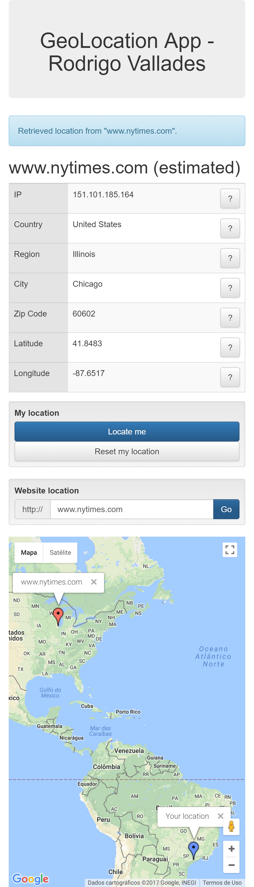

# UI Challenge - Geolocation App #

## About my solution

I had to learn how the Google Maps Javascript API works. I'm working with a single instance, adding markers and removing markers on the fly without re-instantiating the map. I'm also using fitBounds to make all markers visible at the same time (zoom out). I made sure that the application works in different view sizes.

## Frameworks used

* Bootstrap: I used Bootstrap to speed up the responsive aspects and just make the application more visually pleasing
* UnderscoreJS: I used Underscore JS do make ir easier to deal with arrays
* AngularJS: I used AngularJS to take care of the routing and make it easier to update the UI.

## Requirements

Requires a webserver to use AnguarJS routes.

Suggested tools:

* Node.js
* npm

## How to run the application using npm

* npm install
* npm start

A webserver will be started on localhost:3000

## Screenshots

---

### Story Phrase ###
* As a curious web surfer, I want to be able to locate both me and any website on a map.
* I sometimes use a desktop, sometimes a tablet and sometimes a cell phone, so I need a responsive web page.

### Business Narrative / Scenario ###
* GeoLocation is a working web application which aims to retrieve details about the user's location. 
* You need to augment GeoLocation with a new form that will allow the user to find out the physical location of websites, by displaying its hosting position on a map. 
* This new form will consist of a text field for the user to input the website domain.  It will also need a "Locate" button.
* You have to keep the current features working.

### Functional / Acceptance Criteria ###
* The new form input field should only accept website domains starting with "www."  or with the host name, e.g., "www.nytimes.com", "nytimes.com" or "g1.com.br" or "www.g1.com.br".
* When the user hits the Locate button, an asynchronous call should be made to http://freegeoip.net/json/:host, where :host corresponds to the user input.
* If this async call is successful, a second panel must be rendered, below the form, displaying a map showing the website's physical location from the latitude and longitude coordinates of the JSON response.
* When the user hits the existing My location button, his position must also be displayed on the map, **alone or besides a website location** if the user used that feature before.
* When the user hits the Reset location button, the user location must be cleared off from the map (but the website's location should still be displayed, if any).
* You should handle user input and server response validations for all scenarios.
